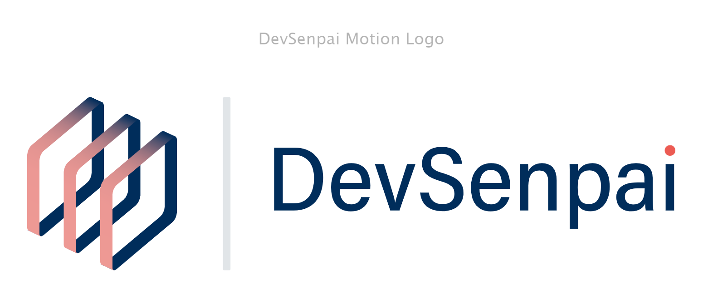

# DevSenpai Motion Logo

This is a motion logo for My Brand.

## Table of contents

- [Screenshot](#screenshot)
- [Links](#links)
- [Built with](#built-with)
- [What I learned](#what-i-learned)
- [Useful resources](#useful-resources)
- [Author](#author)

### Screenshot

### Links

- Live Site URL: [Add live site URL here](https://your-live-site-url.com)

### Built with

- JSX
- CSS custom properties
- Grid
- Mobile-first workflow
- React
- Framer Motion

### What I learned

- I learnt how to create animation with Framer Motion

### Useful resources

- [Resource 1](https://www.youtube.com/watch?v=2V1WK-3HQNk&list=PL4cUxeGkcC9iHDnQfTHEVVceOEBsOf07i) - This Net Ninja series helped me alot to better understand how use Framer Motion

## Author

- Website - [DevSenpai](https://www.your-site.com)
- Twitter - [@DevSenpai09](https://twitter.com/DevSenpai09)
